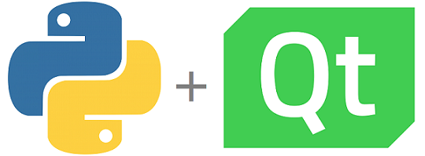

# CURSO DE PYQT
👨‍⚖️PYQT É UM CONJUNTO DE BINDINGS PARA O TOOLKIT GUI QT. ELE PERMITE O USO DA BIBLIOTECA QT COM A LINGUAGEM PYTHON PARA CRIAR INTERFACES GRÁFICAS DE USUÁRIO (GUIS) ROBUSTAS E MULTIPLATAFORMA.

  

## CONCEITO:
PyQt é um conjunto de bindings para o toolkit GUI Qt, desenvolvido pela empresa Riverbank Computing. Ele permite que desenvolvedores usem a biblioteca Qt com a linguagem de programação Python para criar interfaces gráficas de usuário (GUIs) robustas e multiplataforma.

## SUA HISTÓRIA:
PyQt foi criado por Phil Thompson e é mantido pela Riverbank Computing. A primeira versão foi lançada em 1998, e desde então, tem sido regularmente atualizada para acompanhar as novas versões do Qt e do Python. PyQt suporta tanto a licença GPL quanto a licença comercial, permitindo seu uso em projetos open source e proprietários.

## CARACTERÍSTICAS:
### POSITIVAS:
- **Multiplataforma**: PyQt permite criar aplicativos que rodam em Windows, macOS e Linux sem a necessidade de grandes mudanças no código.
- **Ampla documentação e comunidade**: Há uma vasta quantidade de documentação, tutoriais e uma comunidade ativa que pode ajudar com dúvidas e problemas.
- **Suporte a várias versões do Qt**: PyQt é compatível com diversas versões do Qt, proporcionando flexibilidade no desenvolvimento.
- **Integração com Designer**: O Qt Designer permite criar GUIs visualmente, que podem ser facilmente integradas com o código Python usando PyQt.
- **Ampla funcionalidade**: Suporte para uma ampla gama de componentes, desde widgets simples a gráficos avançados e redes.

### NEGATIVAS:
- **Complexidade**: Pode ser complexo para iniciantes, especialmente para aqueles que não estão familiarizados com o modelo de sinal e slot do Qt.
- **Performance**: Em alguns casos, o desempenho de aplicativos PyQt pode não ser tão bom quanto os escritos diretamente em C++ com Qt.
- **Licenciamento**: A licença GPL pode não ser adequada para todos os projetos, exigindo uma licença comercial para desenvolvimento de software proprietário.
- **Tamanho do aplicativo**: Aplicativos criados com PyQt podem ser relativamente grandes em termos de tamanho do arquivo final, devido às dependências do Qt.

## SUBSIDIOS:
- [CURSO CRIADO PELO "PROFESSOR NETO PASCHOAL"](https://youtube.com/playlist?list=PLwsAoT89dh3qJ8JcprQ8AuHY8AGasvx4G&si=-YywudgvCZhU3H70)
- [CURSO FEITO PELO VILHALVA](https://github.com/VILHALVA)
- [VEJA A DOCUMENTAÇÃO DO QT](https://doc.qt.io/qtforpython-6/)
- [VEJA A DOCUMENTAÇÃO DO PYQT](https://www.riverbankcomputing.com/static/Docs/PyQt5/)
- [LINGUAGEM DE PROGRAMAÇÃO](https://github.com/VILHALVA/CURSO-DE-PYTHON)
- [VEJA O MANUAL](./MANUAL.md)
- [VEJA A SINTAXE](./SINTAXE.md)
- [VEJA OS PROJETOS](https://github.com/VILHALVA?tab=repositories&q=topic:PYQT)

